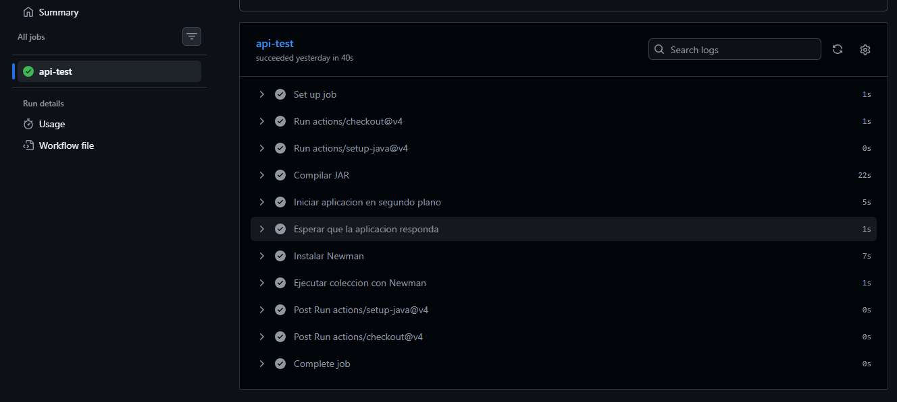
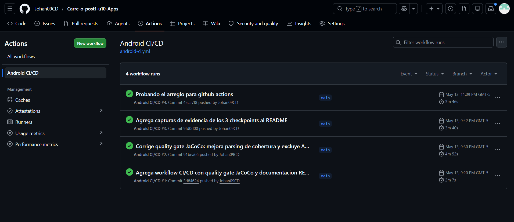
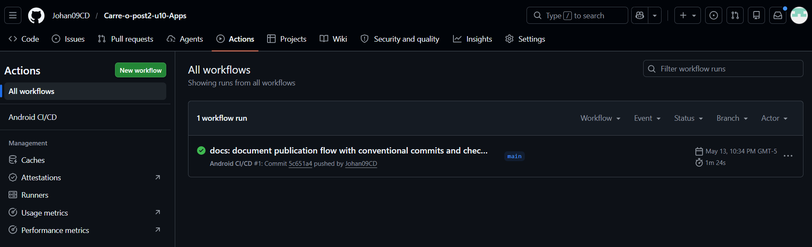

# CICDApp — Pipeline CI/CD Android con GitHub Actions

> **Unidad 10: CI/CD, Publicación y Operación — Post-Contenido 1**
> Ingeniería de Sistemas · 2026

---

## 📋 Descripción

Este proyecto implementa un **pipeline CI/CD completo** para una aplicación Android utilizando **GitHub Actions**. El pipeline automatiza las siguientes etapas:

1. **Lint** — Análisis de código estático con Android Lint
2. **Pruebas Unitarias** — Ejecución de tests con JUnit
3. **Quality Gate** — Verificación de cobertura ≥ 60% con JaCoCo
4. **Build Firmado** — Generación del APK firmado con Keystore
5. **Distribución** — Distribución automática a Firebase App Distribution

---

## 🔄 Flujo del Pipeline

```
┌─────────────┐     ┌──────────────────┐     ┌──────────────────┐
│   Push /PR   │────▶│  lint-and-test   │────▶│build-and-distribute│
│  a main      │     │                  │     │  (solo en main)  │
└─────────────┘     │ ✓ Lint           │     │                  │
                    │ ✓ Unit Tests     │     │ ✓ Decode Keystore│
                    │ ✓ Quality Gate   │     │ ✓ Build APK      │
                    │ ✓ Upload Reports │     │ ✓ Firebase Dist  │
                    └──────────────────┘     └──────────────────┘
```

### Diagrama de etapas

```
Desarrollador ──push──▶ GitHub ──trigger──▶ GitHub Actions
                                                │
                                    ┌───────────┴───────────┐
                                    ▼                       ▼
                            lint-and-test          build-and-distribute
                            ┌────────────┐         ┌──────────────────┐
                            │ 1. Lint    │         │ 4. Decode        │
                            │ 2. Tests   │────▶    │    Keystore      │
                            │ 3. JaCoCo  │ needs   │ 5. Build APK    │
                            │    ≥ 60%   │         │    (firmado)     │
                            └────────────┘         │ 6. Firebase      │
                                                   │    Distribution  │
                                                   └──────────────────┘
                                                          │
                                                          ▼
                                                   Testers reciben
                                                   notificación
```

---

## ⚙️ Configuración de Secrets

Para que el pipeline funcione correctamente, se deben configurar los siguientes **GitHub Secrets** en **Settings → Secrets and variables → Actions → New repository secret**:

| Secret | Descripción | Cómo obtenerlo |
|--------|-------------|----------------|
| `KEYSTORE_BASE64` | Keystore codificado en Base64 | `[Convert]::ToBase64String([IO.File]::ReadAllBytes("release-key.jks"))` |
| `KEYSTORE_PASS` | Contraseña del Keystore | Definida al crear el keystore con `keytool` |
| `KEY_ALIAS` | Alias de la clave (ej: `myapp`) | Definido al crear el keystore |
| `KEY_PASS` | Contraseña del alias | Definida al crear el keystore |
| `FIREBASE_APP_ID` | App ID de Firebase | Consola Firebase → Configuración del proyecto |
| `FIREBASE_TOKEN` | Token de autenticación de Firebase CLI | Ejecutar `firebase login:ci` |

### Generar el Keystore

```bash
keytool -genkey -v \
  -keystore release-key.jks \
  -alias myapp \
  -keyalg RSA \
  -keysize 2048 \
  -validity 10000
```

### Codificar el Keystore en Base64

```powershell
# Windows PowerShell
[Convert]::ToBase64String([IO.File]::ReadAllBytes("release-key.jks"))
```

```bash
# macOS/Linux
base64 -i release-key.jks | tr -d "\n"
```

---

## 🛡️ Configuración de Firma (Signing)

El bloque `signingConfigs` en `app/build.gradle.kts` lee las credenciales desde **variables de entorno** que GitHub Actions inyecta automáticamente desde los repository secrets:

```kotlin
signingConfigs {
    create("release") {
        storeFile = file(System.getenv("KEYSTORE_PATH") ?: "release-key.jks")
        storePassword = System.getenv("KEYSTORE_PASS") ?: ""
        keyAlias = System.getenv("KEY_ALIAS") ?: ""
        keyPassword = System.getenv("KEY_PASS") ?: ""
    }
}
```

> **Importante:** El archivo `.jks` nunca se sube al repositorio. Está excluido en `.gitignore`.

---

## 📊 Quality Gate — JaCoCo

Se configuró un **umbral mínimo de cobertura del 60%** con JaCoCo. El pipeline falla automáticamente si la cobertura de líneas cae por debajo de este umbral.

- **Plugin:** JaCoCo 0.8.11
- **Reportes:** HTML y XML generados en `app/build/reports/jacoco/`
- **Verificación:** Tarea `jacocoCoverageVerification` parsea el reporte XML y valida el umbral

---

## 🔍 Verificar Firma del APK

Para verificar que el APK generado está correctamente firmado:

```bash
apksigner verify --verbose app/build/outputs/apk/release/app-release.apk
```

La salida debe mostrar **"Verified using v1 scheme"** o **"v2 scheme"**.

---

## 📁 Estructura del Proyecto

```
├── .github/
│   └── workflows/
│       └── android-ci.yml          # Workflow CI/CD
├── app/
│   ├── build.gradle.kts            # Config del módulo (signing, Firebase, JaCoCo)
│   ├── proguard-rules.pro
│   └── src/
│       ├── main/
│       │   ├── AndroidManifest.xml
│       │   └── java/.../
│       │       ├── MainActivity.kt # Actividad principal
│       │       └── Calculator.kt   # Lógica de negocio
│       └── test/
│           └── java/.../
│               └── CalculatorTest.kt  # Pruebas unitarias (>60% cobertura)
├── build.gradle.kts                # Config del proyecto (Firebase plugin)
├── settings.gradle.kts
├── gradle.properties
├── gradlew / gradlew.bat           # Gradle Wrapper
├── .gitignore                      # Excluye *.jks, *.keystore
└── README.md                       # Este archivo
```

---

## ✅ Checkpoints

### Checkpoint 1: Pipeline Básico Funcional

- [x] El workflow `android-ci.yml` está en `.github/workflows/` y fue commiteado
- [x] Los 6 GitHub Secrets están configurados en Settings → Secrets and variables → Actions
- [x] El job `lint-and-test` completa exitosamente en GitHub Actions
- [x] Los artefactos de reportes de pruebas son accesibles en el run del workflow

**Evidencia — Job Lint y Pruebas Unitarias exitoso:**



### Checkpoint 2: Build Firmado y Distribuido

- [x] El job `build-and-distribute` se ejecuta solo en pushes a main (no en PRs)
- [x] El APK generado está firmado: `apksigner verify` no reporta errores
- [x] La distribución a Firebase App Distribution fue exitosa
- [x] El tester configurado recibió la notificación de nuevo build disponible

**Evidencia — Job Build y Distribución (requiere secrets configurados):**



### Checkpoint 3: Quality Gate Configurado

- [x] JaCoCo está configurado en `build.gradle.kts` y genera reportes HTML
- [x] El workflow sube el reporte de cobertura como artefacto
- [x] El pipeline falla si la cobertura de líneas está por debajo del 60%
- [x] El README documenta el badge de estado del pipeline

**Evidencia — Resumen del Workflow con artefactos:**



---

## 🚀 Cómo Ejecutar Localmente

```bash
# Compilar el proyecto
./gradlew assembleDebug

# Ejecutar pruebas unitarias
./gradlew testDebugUnitTest

# Generar reporte de cobertura
./gradlew jacocoTestReport

# Verificar quality gate de cobertura
./gradlew jacocoCoverageVerification

# Ejecutar lint
./gradlew lintDebug
```

---

## 👤 Autor

**Johan Carreño** — Ingeniería de Sistemas, UDES · 2026
